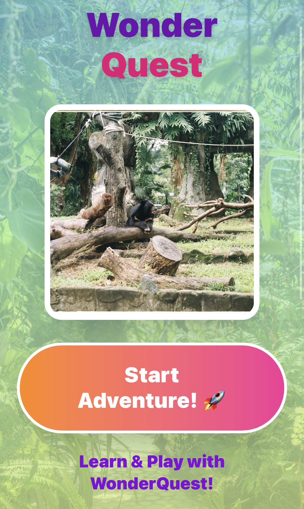

# WonderQuest

> An AI-powered interactive learning platform for children aged 8 to 10 that integrates generative AI, stateful mini-games, and adaptive contextual hints to support early childhood education.


---

## Project Overview

WonderQuest was designed and prototyped as part of the **CN330 Computer Application Development** curriculum at Thammasat School of Engineering. The system addresses engagement challenges in early childhood education by combining AI-narrated storytelling with multi-modal learning modules, including math challenges, animal sound recognition, and spelling activities.

---

## Prototype & Interactive Demo

* **Interactive Figma Prototype:** [View Live Figma Prototype](https://www.figma.com/make/8CEWes2QYDGyEuBppXYGn8/AI-Story-Adventure-Prototype?t=c3paAW3aAkuIwCoc-1)



### How to Navigate the Demo
1. Open the prototype link above in your web browser.
2. Click the **Play (Present)** icon in the top-right toolbar of Figma to enter interactive presenter mode.
3. Click directly on active UI elements (buttons, story cards, hint icons) to test the stateful user flow.

---

## Key System Features

* **AI Narrator & Story Progression:** Uses generative AI logic to deliver narrative context (e.g., "Jungle Adventure") and guide young learners through gamified levels.
* **Multi-Modal Learning Modules:** Includes distinct minigame components:
  * **Math Challenges:** Interactive arithmetic problems with instant evaluation.
  * **Animal Sound & Visual Games:** Audio-visual matching logic for interactive engagement.
  * **Spelling Challenges:** Literacy and word-building exercises.
* **Adaptive Contextual Hinting:** Incorporates LLM-backed scaffolding to deliver hints based on user progress without giving away answers directly.
* **Reward & Progress Tracking:** Tracks stars, level progression, and achievement badges to incentivize task completion.

---

## System Design & Rapid Prototyping Process

1. **Phase 1 — Concept Exploration (Crazy 8s):** Sketched 8 core screen layouts and interaction variations within an 8-minute rapid design sprint, establishing user flows for navigation, gameplay, and reward mechanisms.
2. **Phase 2 — UI/UX & Workflow Architecture:** Structured user flows in Figma to map state transitions between home, story narration, active challenges, hint modals, and reward screens.
3. **Phase 3 — LLM Integration Logic:** Modeled prompt structures and state progression for dynamic hint escalation based on continuous user attempts.

---

## Tech Stack & Architecture Concepts

* **Prototyping & Interface Design:** Figma
* **Core Architecture Concepts:** Agentic Workflow Design, LLM Prompt Engineering, Adaptive Scaffolding
* **Domain Focus:** Educational Technology (EdTech), Human-Computer Interaction (HCI) for Kids (Ages 8–10)

---

## Repository Structure

```text
wonderquest/
├── docs/
│   ├── crazy8s-sketch-sheet.pdf
│   └── WonderQuest.png
└── README.md
